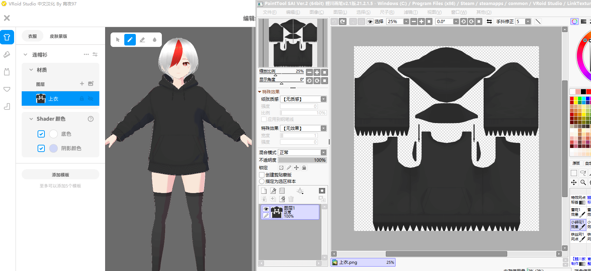
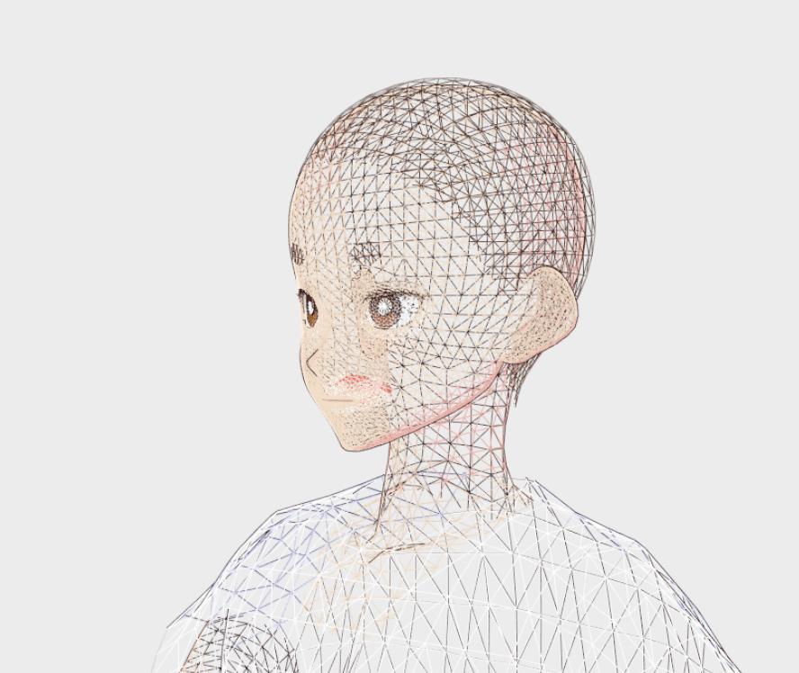

# VRoidXYTool

[中文说明](README.md)

Extension Plugin for VRoid Studio

## Why is the plug-in unavailable after VRoid Studio 1.18?
You can edit VRoid Studio\BepInEx\config\BepInEx.cfg, change `HideManagerGameObject = false` to `HideManagerGameObject = true`, then VRoidXYTool can work on the new version VRoid Studio.

## Introduce

- Base on [BeplnEx][1]
- Link Texture Tool. You can edit image in drawing tools(eg PS/SAI), when you save file, the file will auto sync to VRoidStudio.
- Camera Tool. Quickly set the position of the camera around the body or around the head. Set camera orthographic or perspective mode.
- Guide Tool. Add grid and guide image to VRoid Studio.
- Pose Perset Tool. In the PhotoBooth and pose mode, you can save and load custom pose perset.
- Anti-Aliasing.
- MMD Player(WIP). You can import VMD  files in the VRoid Studio for play
- Video Record. Do not rely on external software to record HD video in vroidstudio
- Wireframe Mode.

## Tutorial

- Tutorial Video[bilibili][2] (now only chinese video, If you have recorded tutorials in other languages, you can submit links to me.)

## Q&A

`Q:` I don't have the bepinex folder in the video. What should I do?

`A:` Install [BeplnEx][1]

`Q:` I installed the plugin. How can I open it in the VRoid Studio?

`A:` Tab or edit hotkey in BepInEx/config/me.xiaoye97.plugin.VRoidStudio.VRoidXYTool.cfg, `Hotkey = Tab`

`Q:` How can I contact you?

`A:` VRoid QQGroup(684544577), My private QQGroup (528385469), discord xiaoye#3171(Slow reply), Twitter @xiaoye1997 (Slow reply)

[1]: https://github.com/BepInEx/BepInEx/releases
[2]: https://www.bilibili.com/video/BV1TP4y1V7Qn/
[3]: https://www.bilibili.com/video/BV1BL41137Tc/